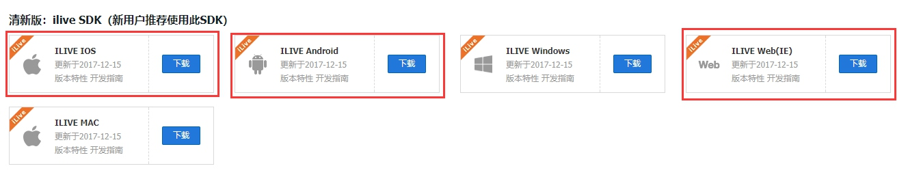

# 场景：
>老师一对一教学（老师学生音视频对讲，并共享老师端电脑屏幕供学生观看，及教学过程视频回放）

# 应用平台
> 依赖于腾讯云互动直播


1. 客户端：
    - 学生端：ILIVE IOS ，ILIVE Android
    - 老师端：ILIVE Web(IE)（https://github.com/zhaoyang21cn/iLiveSDK_Web_Suixinbo）（老师教学端参考本实例 使用Js iLiveSDK （https://zhaoyang21cn.github.io/iLiveSDK_Help/web_help/））
2. 服务端：SuiXinBoPHPServer（https://github.com/zhaoyang21cn/SuiXinBoPHPServer）（*服务端只用了腾讯云的用户Sig生成工具，未使用其余程序逻辑*）

# 实现步骤：
## 服务器端：
> 服务端主要完成：使用腾讯云TSL （https://cloud.tencent.com/document/product/269/1510)生成用户sig及房间roomid （服务器本地程序生成）

客户端与服务器交互流程：


1. 配置腾讯云开发后台：
> App基础设置：帐号体系集成->独立模式（用户数据存储在自有服务器）保存后会有*公私钥下载* 需上传到自有服务器


2.用户sig生成代码编写(源代码在事例的model\Account.php文件夹内)：
-  *qcloud_appid为 互动直播应用管理 appid:*
-  *qcloud_path 为 SuiXinBoPHPServer 下deps（可改名称）目录*
- *deps/keys 下建立以appid为文件夹名称的文件夹 放入对应应用公私钥*
-  *设置deps/sig 读写权限 /bin 可执行权限（建议直接设置deps目录可执行权限）*
```php
    static $qcloud_appid=111;
	static $qcloud_path="/deps";
    /* 功能：生成sig
     * 说明：对当前用户使用指定的sdkappid, 和指定的秘钥文件路径（private_key_path）使用
     *         tls_licence_tools工具生成sig，并sig存储在临时文件中。成功，sig返回给用户后，
     *        失败返回空；同时删除此临时sig文件。此sig用于前端SDK的登录。
     * 备注：这里使用临时文件原因一是受工具tls_licence_tools只能读写文件方式所限；二是
     *        如果使用单个文件过渡将导致并发读写错误的问题。
     *        php另外一种集成sig的方式参考这里：
     *                https://www.qcloud.com/document/product/269/1510
     *                http://bbs.qcloud.com/thread-22519-1-1.html
     */
    public static function genUserSig($uid)
    {
        $sdkappid=self::$qcloud_appid;
        $private_key_path=self::$qcloud_path.'/keys' . '/' .$sdkappid . '/private_key';
        // 创建临时sig文件
        $sig = self::mktemp();
        if(!$sig) {
            return null;
        }
        // 生成sig
        $cmd = self::$qcloud_path . '/bin/tls_licence_tools'
            . ' ' . 'gen'
            . ' ' . escapeshellarg($private_key_path)
            . ' ' . escapeshellarg($sig)
            . ' ' . escapeshellarg($sdkappid)
            . ' ' . escapeshellarg($uid);
        $ret = exec($cmd, $out, $status);

        if ($status != 0)
        {
            return null;
        }

        // 读取sig
        $out=array();
        $cmd = 'cat ' . ' ' . escapeshellarg($sig);
        $ret = exec($cmd, $out, $status);

        self::rmtemp($sig);

        if ($status != 0)
        {
            return null;
        }

        return $out[0];
    }

    /* 功能：创建临时sig文件
    * 说明：使用工具mktemp在deps/sig目录下创建临时文件sxb_sig.XXXXXXXXXX
    *        成功返回临时文件的绝对路径，失败返回null
    */
    private static function mktemp()
    {

        $cmd = 'mktemp -t -p ' .  self::$qcloud_path. '/sig sxb_sig.XXXXXXXXXX';
        $ret = exec($cmd, $out, $status);
        if ($status != 0)
        {
            return null;
        }
        return $out[0];
    }
    /* 功能：删除临时sig文件
     * 说明：使用工具rm强制删除在deps/sig目录下指定的临时文件
     */
    private static function rmtemp($tmp)
    {
        $cmd = 'rm -f ' . $tmp;
        $ret = exec($cmd, $out, $status);
        if ($status != 0)
        {
            return false;
        }
        return true;
    }
```
## 老师端IE 
> 完成老师端视频对讲及共享桌面功能，参考腾讯云实例 https://github.com/zhaoyang21cn/iLiveSDK_Web_Suixinbo，去掉事例注册登陆逻辑 有自有后台直接进入直播间 只使用iLiveSDK 与腾讯云交互和页面事件 去掉与服务器交互及发消息等功能

### 代码配置：
> 把随心播代码中的appid和accountType修改成开发者自己的。即在demo.js(也可以自己创建JS编写相关代码)中找到OnInit方法，找到sdk = new ILiveSDK(1400027849, 11656, "iLiveSDKCom")语句，用自己的SDKAppID（互动直播应用SDKAppID）和accountType（互动直播后台->APP基础设置->帐号体系集成）替换前两个参数
 
### 程序执行步骤（参考demo.js代码）：
1. 在html的head节点中引入js文件,如下:
    ```html
    <script type="text/javascript" src="js/iLiveSDK.js"></script>
    ```
2. 在html的body节点中加载cab文件,路径（对应服务器本地路径）如下
    ```html
        <object id="iLiveSDKCom" classid="CLSID:54E71417-216D-47A2-9224-C991A099C531" codebase="路径/iLiveSDK.cab#version=版本号"></object>
    ```
3. 初始化iLiveSDK
    ```javascript
      sdk = new ILiveSDK(123455, 1234, "iLiveSDKCom");
      sdk.init(function() {
                toastr.success('初始化成功');
                //绑定老师端视频展示区域
                g_localRender = new ILiveRender("localRender");
                //绑定学生端视频展示区域
                g_renders[0] = new ILiveRender("render0");
           
                //更多视频源  
                //   g_renders[1] = new ILiveRender("render1");
                //g_renders[2] = new ILiveRender("render2"); 
               
                //屏幕共享区域视频展示区域
                g_screenRender = new ILiveRender("screenRender");
                //设置监听事件
                sdk.setForceOfflineListener(onForceOfflineCallback);
                sdk.setRoomDisconnectListener(onRoomDisconnect);
                sdk.setRoomEventListener(onRoomEvent);
                sdk.setDeviceOperationCallback(onDeviceOperation);
    
                document.getElementById("version").innerHTML = sdk.version();
                sdk.setMessageListener(function(msg) {
                    showMessage(msg);
                });
            },
            function(errMsg) {
                toastr.warning("初始化失败! 错误码: " + errMsg.code + "描述: " + errMsg.desc);
            });
    ```
4. 用户初始化及创建并进入房间（房间重复创建 不会覆盖之前的房间 也可重新进入）：
    ```javascript
    function OnBtnLogin(roomid,uid,sig) {
        //调用SDK 登陆事件 触发成功登陆或登陆错误事件
        sdk.login(uid, sig, onLoginSuc(roomid), onLoginErr);
        //全局保存用户id 跟sig
        g_id=uid;
        g_userSig = sig;
    }
    //登陆成功
    function onLoginSuc(roomid) {
        //OnBtnGetList();
        toastr.success("登录成功");
        setTimeout(function () {
            //创建房间
            OnBtnCreateRoom(roomid,$('#rotateScreen').prop("checked"))
        },1000)
    }
    //创建房间
    function OnBtnCreateRoom(roomid,rotate) {
                toastr.success("初始化房间:"+roomid);
                sdk.createRoom(roomid, E_iLiveAuthBits.AuthBit_LiveMaster, "LiveMaster", function() {
                    toastr.success("进入房间:"+roomid);
                    g_roomnum=roomid;
                    g_role = E_Role.LiveMaster;
                    jsonObj = {
                        "roomid": roomid,
                    };
                    //可以增加逻辑 与服务器Ajax交互
                    //进入房间后打开摄像头 麦克风及扬声器
                    OnBtnOpenCamera();
                    OnBtnOpenMic();
                    OnBtnOpenPlayer();
                }, function(errMsg) {
                    toastr.error("错误码1:" + errMsg.code + " 错误信息:" + errMsg.desc);
                },rotate); //这个是sdk的事件
    
    }
    ```
5. 打开关闭桌面共享：
    文档：
    


    ```javascript
    
        function OnBtnOpenScreenShareArea() {
            if (g_role == 0) {
                toastr.error('被连麦之后才可以打开屏幕分享');
                return;
            }
            var x0 = 0;
            var y0 = 0;
            var x1 = screen.width;
            var y1 = screen.height;
            if(g_screenRender){
                sdk.closeScreenShare();
            }
            //
            y0=(window.screen.height-window.innerHeight);
            x1=parseInt($("#divwh").width());
            y1 =window.screen.heigh;
            //切换的时候free需要时间，做一个settimeout
            setTimeout(function(){
                sdk.openScreenShareArea(x0, y0, x1, y1);
            },100)
        };
        
        function OnBtnCloseScreenShare() {
            if (g_role == 0) {
                toastr.error('被连麦之后才可以打开屏幕分享');
                return;
            }
            sdk.closeScreenShare();
        };
    ```

## 视频录制：
    视频录制使用直播码模式下旁路直播 （开始录制由iLiveSDK控制）录制回放视频（需在直播控制台开启直播录制）
    直播码模式:每一个旁路直播对应一个唯一的直播码 可在创建房间是保存直播码 用于回放视频地址的更新

>    直播码=BIZID_MD5(房间号_用户名_数据类型)。
    字符串传输按utf-8编码。摄像头数据类型是main，屏幕分享的数据类型是aux。而BIZID是一个固定的参数，可以在直播控制台的顶部找到它。
    假如BIZID=8888,用户名=14y2l2c，房间号=293710，在进行摄像头分享，则MD5(293710_14y2l2c_main)=81265058829fd2e50c8ec2ac78d55127。那么直播码就是8888_81265058829fd2e50c8ec2ac78d55127。
    


1. 直播录制配置（回调URL 会在直播录制成功会通知服务器）


2. 通过iLiveSDK 开启旁路直播推流 代码如下：
    ```javascript
     function startPush(){
            var option1=new ILivePushStreamOption(E_iLivePushDataType.SCREEN,E_iLivePushEncode.HLS, E_iLivePushRecordFileType.NONE)
            sdk.startPushStream(option1, function(params){
                console.log('startPushStream SCREEN success');
                console.log(params);
            },function(){
                console.log('error  SCREEN');
            });
    
            var option=new ILivePushStreamOption(E_iLivePushDataType.CAMERA,E_iLivePushEncode.HLS, E_iLivePushRecordFileType.NONE)
            sdk.startPushStream(option, function(params){
                console.log('startPushStream CAMERA success');
                console.log(params);
            },function(){
                console.log('error CAMERA');
            });
        }
    ```
3.  直播推流结束后 腾讯云会通过回调地址通知服务器（可以更新回放视频地址）：
    ```php
            $qcloud_api_key=11111;
            $arr=file_get_contents('php://input');
            $req_arr=json_decode($arr,true);
            if($req_arr['sign']!=MD5($qcloud_api_key.$req_arr['t'])){
                die('0');
            };
            switch (intval($req_arr['event_type'])){
                //目前腾讯云支持三种消息类型的通知：0 — 断流； 1 — 推流；100 — 新的录制文件已生成；200 — 新的截图文件已生成。
                case 0;//断流
                    break;
                case 1;//推流
                    break;
                case 100;
                    if($req_arr['file_format']=='mp4'){
                        $video_type=2;
                    }else if($req_arr['file_format']=='hls'){
                        //M3u8
                        $video_type=1;
                    }
                //100 新的录制文件已生成
                    break;
            }
    		die('{"code":0}');
    ```


